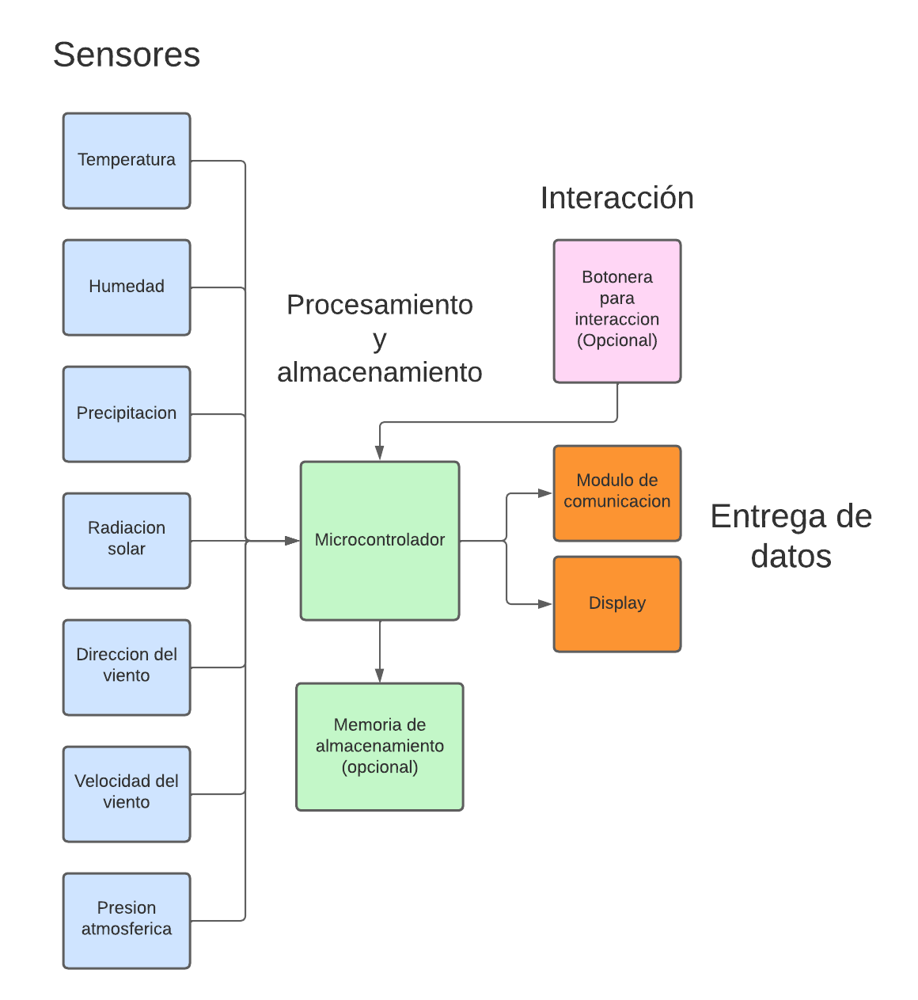

# Anteproyecto: Estacion metereologica

### Indice 

- [Descripcion del proyecto](#descripcion-del-proyecto)
- [Descripcion de la problematica](#descripcion-de-la-problematica)
- [Caracterisiticas del sistema](#caracterisiticas-del-sistema)
- [Estado del arte / Antecedentes](#estado-del-arte--antecedentes)
 - [Estudio de factibilidad](#estudio-de-factibilidad)
- [Diagrama de bloques](#diagrama-de-bloques)
- [Analisis de gastos](#analisis-de-gastos)
- [Planificacion y distribucion de tareas](#planificacion-y-distribucion-de-tareas)

---
## Descripcion del proyecto

### *Descripcion de la problematica:

- Una pequeña estación meteorológica podría solucionar diversas problemáticas relacionadas con la recopilación de datos climáticos y el monitoreo de las condiciones atmosféricas en una ubicación específica. Algunas de las problemáticas que podría abordar son:

  - Predicción del clima local

  - Alertas tempranas de fenómenos meteorológicos extremos

  - Monitoreo de la calidad del aire

  - Investigación científica local

  - Agricultura y gestión del agua

  - Eficiencia energética

  - Seguridad en el transporte

En resumen, una pequeña estación meteorológica puede solucionar problemáticas relacionadas con la falta de datos climáticos precisos y en tiempo real, y puede tener una amplia gama de aplicaciones en diversas áreas, desde la planificación diaria hasta la toma de decisiones críticas en sectores como la agricultura, la investigación científica y la seguridad.

---

### *Caracterisiticas del sistema:
- Una pequeña estación meteorológica generalmente está diseñada para recopilar datos básicos sobre las condiciones climáticas en una ubicación específica. A continuación, se presentan algunas características comunes de una pequeña estación meteorológica:

  - Sensores e instrumentos

  - Transmisión de datos

  - Registro y almacenamiento de datos

  - Alimentación energética
  
  - Durabilidad y protección

  - Interfaz de usuario

  - Conectividad y compatibilidad

- Existen varias mejoras que se podrían implementar en una pequeña estación meteorológica para ampliar su funcionalidad y precisión. Algunas de estas mejoras podrían incluir:

    - Sensores adicionales
    - Comunicación mejorada
    - Integración con sistemas de automatización

    - Interfaz de usuario avanzada

    - Integración con sistemas de alerta temprana

    - Acceso a datos históricos y almacenamiento en la nube

Estas mejoras podrían hacer que la pequeña estación meteorológica sea aún más versátil y valiosa para una variedad de aplicaciones, desde la toma de decisiones en la agricultura y la investigación científica hasta el monitoreo ambiental y la planificación urbana.

---

### *Estado del arte / Antecedentes:

- Durante la busqueda de documentacion para el proyecto, ademas de la busqueda de caracterisiticas, componentes y tecnologias, se buscó estaciones metereologicas ya creadas, se trató de enfocar la busqueda en proyectos a nivel comercial/profesional para informarnos sobre las tecnologias usadas y en proyectos academicos para ver como se aplican dichas tecnologias a un nivel mas amateur.

  - Proyecto comercial: En el mercado existen una infinidad de propuestas de estaciones metereologicas, varian en precios, prestaciones, precision, conectividad, registro, etc. sin embargo existen dos que se asimilan mas a las expectativas sobre el proyecto a realizar.
  
    *[Daza DZWT1081](http://www.sisteco-web.com.ar/products/14-estacion-meteorologica-daza-dzwt1081-wireless.html): Esta estacion permite medir temperatura, humedad, direccion y velocidad del viento, precipitacion, dichas mediciones se muestran mediante un display (Este proyecto abarca los items obligatorios)

    *[Daza DZWH2900](http://www.sisteco-web.com.ar/products/813-estacion-meteorologica-daza-dzwh2900-color-wifi-lux-uv-viento-lluvia-usb.html): Este modelo tiene las mismas prestaciones que el anterior, pero ademas tiene indice UV, alertas para los parametros, previsiones, regsitros, botonera, y conexion wifi para transmision de datos. (Este proyecto abarca los items obligatorios y opcionales)

  - [Proyecto amateur](https://youtu.be/LJszEpV9P0M): Este proyecto tiene algunas de las prestaciones que ofrece una estacion comercial, incluye medicion de temperatura, humedad, direccion y velocidad del viento, precipitacion, indice uv, display y conexion wifi para transmision de datos. Esta seria la expectativa del proyecto a presentar a fin de año.

---

### *Estudio de factibilidad:

  Como ya se vio en la investigacion de los antecedentes de la estacion metereologica existen muchas funciones que se pueden aplicar, pero en el proyecto se van a tomar como esenciales la implementacion de los siguientes items:

  - Sensores:
    - Temperatura
    - Humedad
    - Precipitacion
    - Direccion del viento
    - Velocidad del viento
    - Presion atmosferica
    - Indice UV
  
- Muestra de Datos mediante display

---

### *Diagrama de bloques:

---

### *Analisis de gastos:

 Cant |                       Item                      | Precio
:----:|-------------------------------------------------|---------
 1    |          ESP32 - Wi-Fi & Bluetooth MCU          |  10 U$D
 2 a 6|      Sensor Efecto Hall A3144                   | 1.5 U$D
 1    |        Sensor Intensidad Luz Ultravioleta       | 6.5 U$D
 1    |   Sensor Digital De Humedad Temperatura Htu21d  | 3.5 U$D
 1    |        Sensor Presion Temperatura Bmp280        |   3 U$D
 1    |           Conversor De Nivel 5v 3.3v 8ch        | 2.5 U$D
 1    |                  Bateria                        |
 1    |       Modulo de carga                           |
Total |                                                 | (PRECIO TOTAL)

---

### *Planificacion y distribucion de tareas:

---

